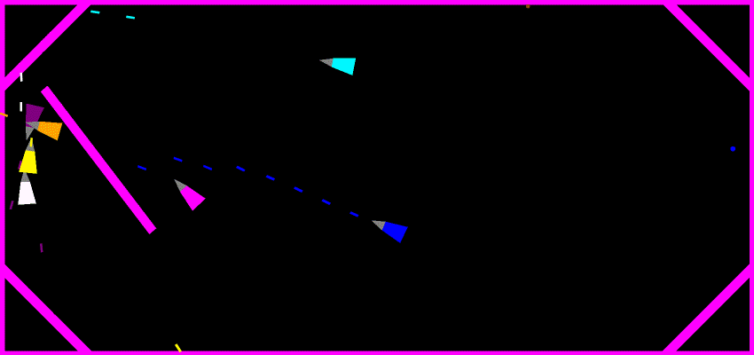

# Planetes
Spaceships dogfight game

Features: 
 - Ships move according to Newtonian mechanics 
 - Ships bounce from walls and other obstacles
 - Multiplayer through Lan
 - Bots

Goals: 
 - Kill all enemies
 - Don't get killed
 - Avoid collision with red asteroids 
 - Catch yellow astreroids to replenish ammo
 - Catch blue asteroids to repair
  
Controls:
 - Steer with WASD
 - Aim and shoot with mouse  
 - Hold R key to record game as GIF

Planned:
 - Actual matches with rules ( kills, deaths, respawns, winners etc)
 - trajectory prediction 
 - grapple 
 - ship-to-ship collisions	
 - gravity field
 - world beyond screen and viewport
