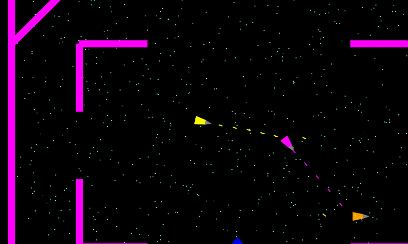

# Planetes
Spaceships dogfight game

Features: 
 - Kinematic movement  
 - Ships bounce from walls and other obstacles
 - Multiplayer through Lan
 - Bots
 - World beyond screen and viewport
 - Matches (only FFA for now)

Goals: 
 - Kill all enemies
 - Don't get killed
 - Avoid collision with red asteroids 
 - Catch yellow astreroids to replenish ammo
 - Catch blue asteroids to repair
  
Controls:
 - Steer with WASD
 - Aim and shoot with mouse  
 - Brake with Spacebar  
 - Hold R key to record a short fragment of a game as GIF  
 - L to scuttle ship (when you're hopelessly stuck)  
 - Num+ and Num- to increase/decrease game speed  

Planned:
 - trajectory prediction 
 - harpoon 
 - missiles  
 - ship-to-ship collisions	
 - gravity field
